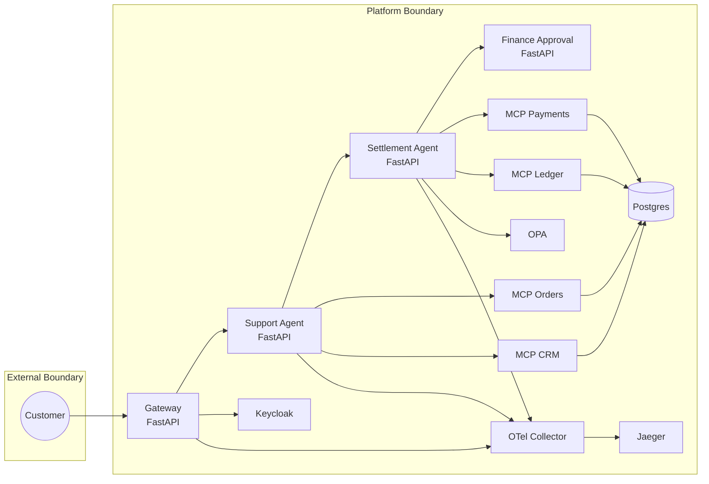
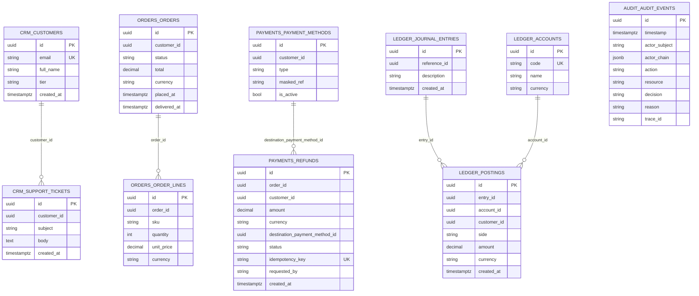

# Architecture

## Data Model

- Schemas are isolated by bounded context: `crm`, `orders`, `payments`, `ledger`, `audit`.
- Cross-schema references are by ID only (no cross-schema foreign keys).
- Monetary values use decimal columns and ISO-4217 currency codes.
- `ledger.postings` and `audit.audit_events` are append-only.

